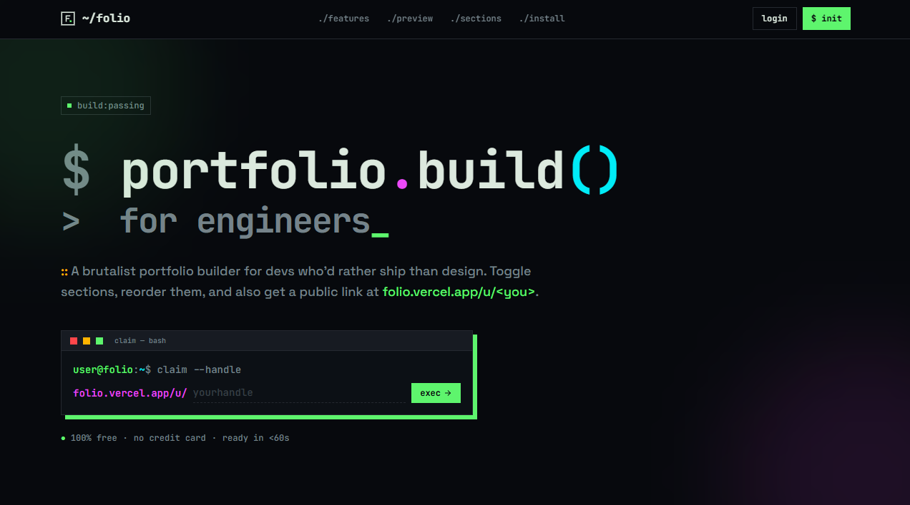

# Folio — Premium Portfolio Engine

Folio is a state-of-the-art portfolio generation platform designed for developers, designers, and creatives who want a professional, high-performance web presence without the overhead of manual coding. Built with the cutting-edge **TanStack Start** framework, it offers a seamless, type-safe development experience and ultra-fast performance.



## ✨ Key Features

### Advanced Theme System
Folio comes with a set of meticulously crafted themes, each offering a distinct aesthetic:
- **Terminal**: A brutalist, command-line inspired theme for a "hacker" aesthetic.
- **Vercel (Light/Dark)**: Clean, high-contrast minimalist design inspired by modern development tools.
- **Material You**: Dynamic, color-adaptive theme with soft edges and fluid layouts.
- **Editorial**: A sophisticated, typography-first layout resembling a premium magazine.
- **Studio**: Bold, high-energy design with glowing accents and deep shadows.

### Intuitive Dashboard
- **Live Preview**: See changes in real-time as you edit your portfolio content and settings.
- **Drag-and-Drop Management**: Reorder sections instantly using a smooth `@dnd-kit` powered interface.
- **Custom Sections**: Beyond standard bio and projects, create custom sections using templates like:
    - **Gallery**: Visual grids for photography or design work.
    - **Stats**: Highlight metrics like GitHub stars, years of experience, or coffee consumed.
    - **Timeline**: Perfect for career milestones or project history.
    - **Link Cards**: Elegant grid of external resources.
- **Granular Customization**: Override global themes with per-section accent colors using a curated palette of 30+ modern colors (OKLCH supported).

### Performance & Infrastructure
- **TanStack Start**: Leveraging the latest in React server components and streaming for lightning-fast loads.
- **Supabase Integration**: Robust authentication and real-time database persistence.
- **Image Handling**: Integrated support for avatar and gallery image uploads.
- **SEO Optimized**: Public portfolios are served on dynamic, SEO-friendly routes (`/u/username`).

## Tech Stack

- **Core**: [React 19](https://react.dev/), [TypeScript](https://www.typescriptlang.org/)
- **Framework**: [TanStack Start](https://tanstack.com/start) (featuring TanStack Router & Query)
- **Styling**: [Tailwind CSS 4](https://tailwindcss.com/)
- **Database & Auth**: [Supabase](https://supabase.com/)
- **UI Primitives**: [Radix UI](https://www.radix-ui.com/)
- **Icons**: [Lucide React](https://lucide.dev/)
- **Drag & Drop**: [@dnd-kit](https://dndkit.com/)
- **Validation**: [Zod](https://zod.dev/) & [React Hook Form](https://react-hook-form.com/)

## Getting Started

### Prerequisites

- [Bun](https://bun.sh/) (Recommended) or Node.js (Latest LTS)
- A [Supabase](https://supabase.com/) project

### Installation

1. **Clone the repository:**
   ```bash
   git clone https://github.com/your-username/folio.git
   cd folio
   ```

2. **Install dependencies:**
   ```bash
   bun install
   ```

3. **Configure Environment Variables:**
   Copy the example environment file and fill in your Supabase credentials:
   ```bash
   cp .env.example .env.local
   ```
   Edit `.env.local` and add your `VITE_SUPABASE_URL` and `VITE_SUPABASE_ANON_KEY`.

4. **Start Development Server:**
   ```bash
   bun dev
   ```
   Your app will be running at `http://localhost:3000`.

### Database Setup

Folio uses Supabase for data persistence. Ensure your Supabase project has the necessary tables by running the SQL in `supabase/schema.sql` within your Supabase SQL Editor:
- `portfolios`: Stores user portfolio configuration, themes, and section visibility.

---

Built with ❤️ by Swapnoneel
